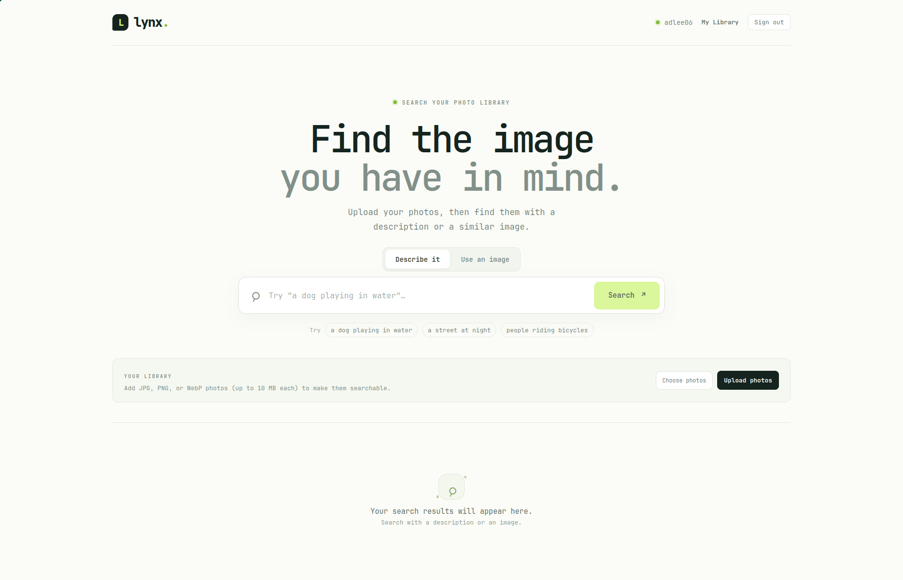
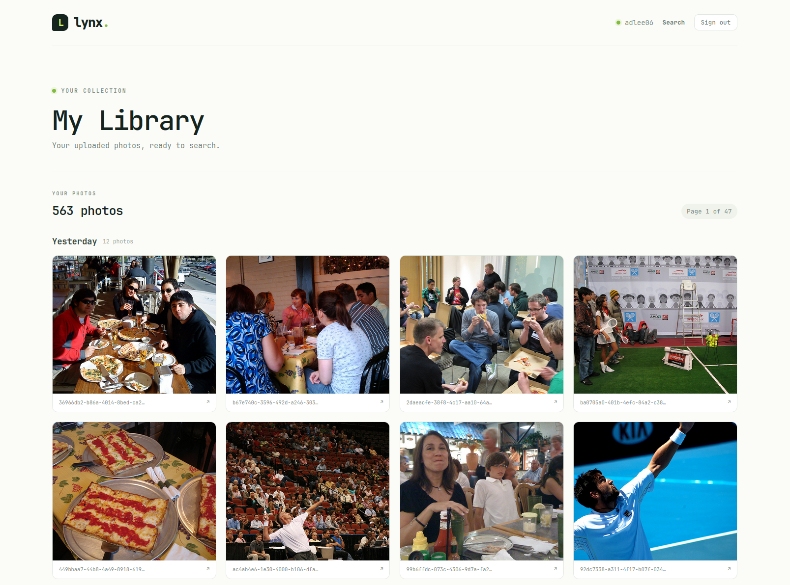
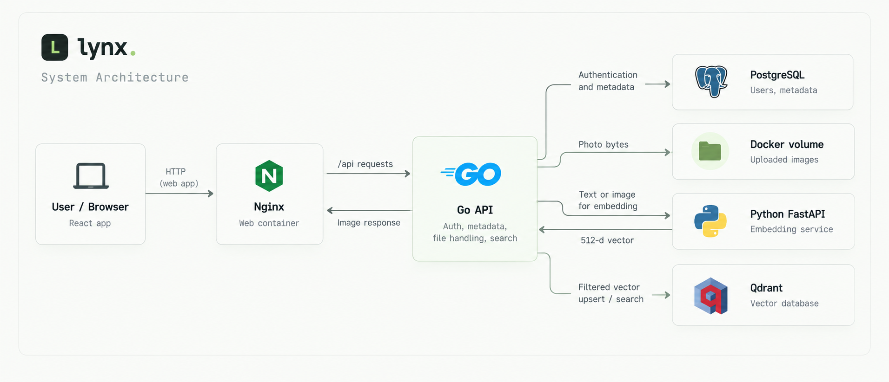
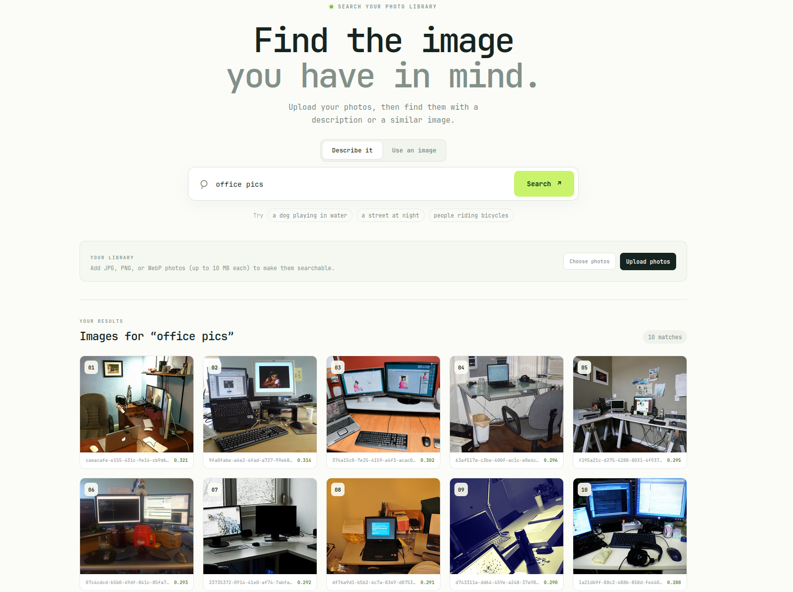
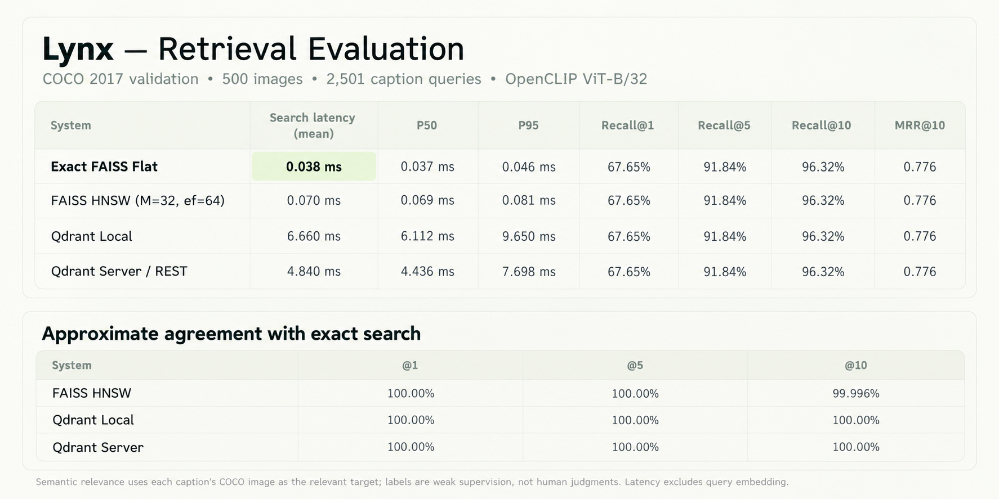

# Lynx

**Lynx** is a semantic photo search application. A user uploads photos to a private library and can search that library either with a natural-language description or with a query photo. Lynx represents text and images as vectors using a pretrained vision-language model, then retrieves visually or semantically similar photos from a vector database.

<!-- IMAGE: Add a screenshot of the Lynx search page here. Suggested file: docs/images/search-page.png -->


## Contents

- [Features](#features)
- [Architecture](#architecture)
- [Technology stack](#technology-stack)
- [How retrieval works](#how-retrieval-works)
- [Data model and storage](#data-model-and-storage)
- [Evaluation](#evaluation)
- [Run Lynx](#run-lynx)
- [API overview](#api-overview)
- [Limitations and future work](#limitations-and-future-work)

## Features

- User registration, login, logout, and authenticated photo-library access.
- Upload one or multiple JPG, PNG, or WebP photos (up to 10 MB per photo).
- Text-to-image search over the signed-in user's library.
- Image-to-image search using a photo as the query.
- Ranked search results with cosine similarity scores.
- A paginated photo library grouped by upload date, with a full-size image view.
- Persistent PostgreSQL, Qdrant, and uploaded-photo storage when run with Docker Compose.

<!-- IMAGE: Add a screenshot of the date-grouped My Library page here. Suggested file: docs/images/my-library.png -->


## Architecture

The Python service is an internal model service. It creates embeddings; it does not own authentication, user records, photo storage, or the production search flow. The Go API coordinates these components and scopes reads and searches to the authenticated user.

### Main request flows

**Photo upload**

1. The signed-in client sends each photo to the Go API with its session token.
2. Go validates the image type and size, sends the bytes to Python, and receives a normalized image embedding.
3. Go writes the original photo to the upload volume and creates its metadata row in PostgreSQL.
4. Go upserts the vector into Qdrant with its UUID, owner ID, and filename.

**Text search**

1. The client sends a text query to Go.
2. Go verifies the session and asks Python to embed the text.
3. Go searches Qdrant with that vector and a filter for the signed-in user's `owner_id`.
4. Go filters results below the configured cosine-similarity cutoff and returns ranked image URLs and scores.
5. The client requests each image from Go; Go checks ownership before serving the image file.

**Image-to-image search** follows the same path, except the uploaded query photo is embedded by the image encoder rather than the text encoder. The temporary query photo is used to create a vector; it is not added to the user's library by the search endpoint.

## Technology stack

| Area | Technology | Use in Lynx |
|---|---|---|
| Web client | React, TypeScript, Vite | Interactive search and library interface; development and production builds. |
| Client package manager | Bun | Dependency installation and client scripts. |
| Web serving / proxy | Nginx | Serves static client files and proxies API traffic to Go. |
| API | Go (`net/http`) | Authentication, library APIs, upload handling, and service coordination. |
| Relational database | PostgreSQL 17 | Account, session, and photo metadata. |
| Vector database | Qdrant | Persistent vector collection, cosine search, and owner filtering. |
| Embedding API | Python, FastAPI, Uvicorn | HTTP interface for producing text and image embeddings. |
| ML runtime | PyTorch, OpenCLIP, Pillow | Model inference, tokenization, and image preprocessing. |
| Retrieval evaluation | FAISS, Qdrant client, NumPy | Exact and approximate index comparisons and benchmark calculations. |
| Local orchestration | Docker Compose | Runs the complete five-service application and its persistent volumes. |

## How retrieval works

### Model

Lynx loads **OpenCLIP ViT-B/32**, pretrained with the `laion2b_s34b_b79k` checkpoint. The model has an image encoder and a text encoder trained to map related image and text inputs into a shared representation space. Lynx uses the model without fine-tuning it.

The image encoder preprocesses the photo and converts it into a **512-dimensional vector**. The text encoder tokenizes a description and produces a vector in the corresponding shared space. The service L2-normalizes both vectors. This makes inner product equivalent to cosine similarity and gives Qdrant comparable vectors for ranking.

For an image query, Lynx embeds the query photo and compares its vector with the user's stored image vectors. For a text query, it embeds the description and compares that text vector with the same stored image vectors.

### Similarity and result filtering

The `lynx_images` Qdrant collection uses cosine distance. The Go API currently requests up to 10 results. Its default minimum scores are **0.19 for text search** and **0.35 for image search**. These are practical demo cutoffs and can be adjusted in `backend/api.go` as the data changes. A cosine score is a similarity measure, **not a calibrated probability or confidence that the result is correct**.

<!-- IMAGE: Add an example showing a text query and its ranked results. Suggested file: docs/images/text-search-example.png -->


<!-- IMAGE: Add an example showing an image query and its visually similar results. Suggested file: docs/images/image-search-example.png -->


## Data model and storage

### PostgreSQL schema

The Go API creates the tables during startup (`backend/database.go`).

```text
users
  id            BIGSERIAL PRIMARY KEY
  username      VARCHAR(32) UNIQUE NOT NULL
  salt          BYTEA NOT NULL
  password_hash BYTEA NOT NULL
  created_at    TIMESTAMPTZ NOT NULL

sessions
  token_hash BYTEA PRIMARY KEY
  user_id    BIGINT REFERENCES users(id) ON DELETE CASCADE
  expires_at TIMESTAMPTZ NOT NULL

images
  id           UUID PRIMARY KEY
  owner_id     BIGINT REFERENCES users(id) ON DELETE CASCADE
  filename     TEXT UNIQUE NOT NULL
  content_type TEXT NOT NULL
  created_at   TIMESTAMPTZ NOT NULL
```

An index on `images.owner_id` supports per-user library queries. Passwords are stored as salted hashes, and sessions are looked up by a token hash.

### Qdrant collection

The Go API ensures a collection named **`lynx_images`** exists with **512-dimensional cosine vectors**. A point contains:

```text
id:      image UUID (matches images.id in PostgreSQL)
vector:  normalized 512-dimensional CLIP image embedding
payload:
  owner_id: user ID (keyword)
  filename: stored photo filename
```

Qdrant has a keyword payload index on `owner_id`. Searches filter on that field, so a user searches only their own collection entries. PostgreSQL remains the source for ownership and photo metadata; Qdrant is the source for vector similarity ranking.

### Photo files and persistence

Photo bytes are stored on the filesystem used by the Go API, not inside PostgreSQL or Qdrant. In Compose, Go writes them under `/data/uploads/<user-id>/` and that directory is backed by the named `lynx_uploads` Docker volume. PostgreSQL data and Qdrant data have their own named volumes. `docker compose down` preserves these volumes; `docker compose down -v` removes them and their data.

When running Go directly on the host, the default relative upload directory is `uploads/` under the Go process's working directory. Host-run uploads and Compose-volume uploads are separate stores; use Compose consistently to see the same Compose-managed photo library.

## Evaluation

The retrieval evaluation in `embedding-service/evaluate_retrieval.py` uses cached image embeddings from `clip_smoke.py` and COCO 2017 validation captions. The recorded run in `embedding-service/evaluation_results.json` used a deterministic subset of **500 images** and **2,501 matching captions** as text queries. For each caption, its own COCO image is treated as the relevant target.

<! Image -->
Text embedding for the 2,501 captions took **14.50 seconds total in batched inference**, averaging **5.80 ms per caption within that batch**. This is not single-query end-to-end latency.


For the full recorded values and run metadata, see [`evaluation_results.json`](embedding-service/evaluation_results.json).

<!-- IMAGE: Add a chart comparing retrieval quality and latency. Suggested file: docs/images/evaluation-results.png -->


## Run Lynx

### Full stack with Docker Compose

Requirements: Docker Engine or Docker Desktop with Compose support.

```bash
docker compose -f compose.yaml up --build -d
```

Open <http://localhost:3000>, register an account, upload photos, then search with text or a query image. The services are:

| Service | Compose service | Host address |
|---|---|---|
| Web application | `client` | <http://localhost:3000> |
| Go API | `backend` | <http://localhost:8080> |
| PostgreSQL | `postgres` | `localhost:5433` |
| Qdrant REST API | `qdrant` | <http://localhost:6333> |
| Embedding API | `embedding-service` | Internal to the Compose network |

The model checkpoint is downloaded during the embedding-service image build, so it is available when the container starts. The Compose embedding container uses CPU inference for portability. PostgreSQL, Qdrant, and uploaded photos persist in named volumes.

Useful commands:

```bash
docker compose -f compose.yaml logs -f
docker compose -f compose.yaml ps
docker compose -f compose.yaml down
```

`down` preserves named volumes. **`docker compose -f compose.yaml down -v` deletes the volumes and all data stored in them.**

### Run with host development servers

Start the PostgreSQL and Qdrant containers:

```bash
docker compose -f compose.yaml up -d postgres qdrant
```

In separate terminals, start the embedding service, Go API, and client:

```bash
cd embedding-service
source .venv/bin/activate
uvicorn api:app --reload --port 8000
```

```bash
cd backend
go run .
```

```bash
cd client
bun install
bun run dev
```

The local Go API defaults to PostgreSQL at `localhost:5433`, Qdrant at `localhost:6333`, and the embedding service at `localhost:8000`. Override `DATABASE_URL`, `QDRANT_URL`, `QDRANT_API_KEY`, `EMBEDDING_SERVICE_URL`, or `LYNX_UPLOAD_DIR` as needed. Host-run Go uploads and Compose uploads use different storage unless deliberately configured to share a directory.

## API overview

The Go API exposes these routes (authenticated routes require a bearer session token):

| Method | Route | Purpose |
|---|---|---|
| `GET` | `/api/health` | Backend health check. |
| `POST` | `/api/register` | Create an account and session. |
| `POST` | `/api/login` | Authenticate and create a session. |
| `POST` | `/api/logout` | Expire the current session. |
| `POST` | `/api/upload` | Upload and index one photo. The client sends multiple selected photos as individual requests. |
| `GET` | `/api/library?page=1&page_size=12` | Return a page of the user's photos, newest first. |
| `POST` | `/api/search` | Search the user's photos with a text query. |
| `POST` | `/api/search/image` | Search the user's photos using an image query. |
| `GET` | `/api/images/{filename}` | Serve a photo after checking ownership. |

The embedding service's internal API provides `GET /health`, `POST /embed/text`, and `POST /embed/image`.

## Limitations and future work

- The evaluation is small and uses COCO caption-to-source-image matching rather than human relevance judgments.
- Similarity cutoffs are fixed demo defaults, not calibrated confidence values; broader threshold evaluation could measure precision/recall trade-offs.
- The Compose embedding service runs on CPU. GPU acceleration or batching could be evaluated for larger ingestion workloads.
- The current design stores photo files on a Docker volume. A cloud deployment would need a managed object-storage solution and an explicit migration and access-control design.
- Additional work could include larger and user-provided evaluation sets, measured end-to-end API latency, deletion and re-indexing flows, and scalable background embedding jobs.